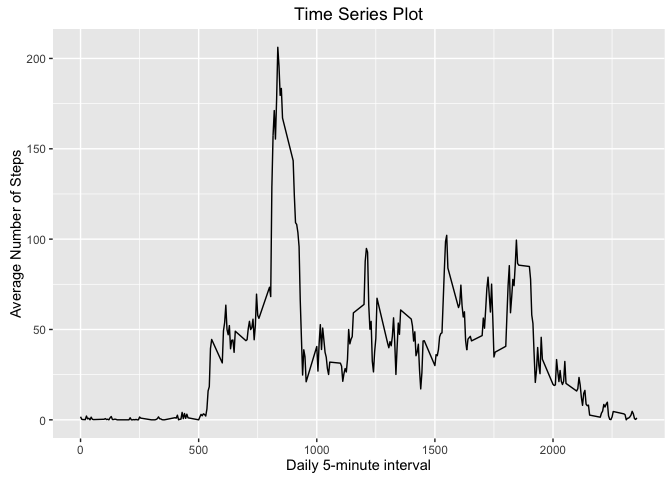

# Reproducible Research: Peer Assessment 1
8 Jan 2016  
In this file you will find my report for the *Peer Assessment 1* of the [Reproducible Research][a] course offered by [Coursera][b].
   
   
## Loading and preprocessing the data
In this section, I wrote the r code needed to load and preprocess the data to be used in this assignment.


```r
setwd("/Users/mmfonseca/git/Coursera_Data_Reproducibility/RepData_PeerAssessment1-master")

# Download file if not present in working directory
# the file is compressed (zip)
filePathZip <- "./activity.zip"
fileUrl <- "https://d396qusza40orc.cloudfront.net/repdata%2Fdata%2Factivity.zip"

## download file and unzip 
if (!file.exists(filePathZip)) {        
        download.file(fileUrl, destfile = filePathZip, method = "curl")
        dateDownload <- date()
        show(dateDownload)
        unzip("activity.zip")
        ## [1] "Fri Jan  8 16:12:37 2016"
}

## loading the data
ActivityData <- read.csv("activity.csv", header=T)
```

The table is already in a suitable format for the analysis.
Let's check the structure of the table:
<br>

```
str(ActivityData)
'data.frame':        17568 obs. of  3 variables:
  $ steps   : int  NA NA NA NA NA NA NA NA NA NA ...
  $ date    : Factor w/ 61 levels "2012-10-01","2012-10-02",..: 1 1 1 1 1 1 1 1 1 1 ...
 $ interval: int  0 5 10 15 20 25 30 35 40 45 ...
```

## What is mean total number of steps taken per day?

*1. Calculate the total number of steps taken per day*   
In the following command, the number of steps taken per day will be summed up. Each row will contain the steps of one given day:
<br>


```r
StepsPerDay <- aggregate(steps ~ date, data = ActivityData, sum)
```
<br>

*2. Make a histogram of the total number of steps taken each day*

```r
## load ggplot2 library
library(ggplot2)
```

```
## Warning: package 'ggplot2' was built under R version 3.2.3
```

```r
## Take the column "steps" from the "StepsPerDay" dataset and make a histogram of it
ggplot(data=StepsPerDay, aes(steps)) + 
        geom_histogram(breaks=seq(0,25000, by=2500), 
                       col="red",
                       fill="green",
                       alpha= .5) +
        geom_rug(aes(y=-.5), position="jitter", sides="b") +
        labs(title="Histogram for Total Number of Steps taken each Day")
```

 
<br>

*3. Calculate and report the mean and median of the total number of steps taken per day*   
For this step, we can use the dataframe created previously (StepsPerDay).
Note that missing data will be ignored.   

```
Mean_StepsPerDay <- mean(StepsPerDay$steps)
Mean_StepsPerDay
[1] 10766.19
```   

Likewise, we can use the function "media()" to calculate the median of the total number of steps taken per day.
Note that missing data will be ignored.   
```
Median_StepsPerDay <- median(StepsPerDay$steps)
Median_StepsPerDay
[1] 10765
```   

> The mean of the total number of steps taken per day is **10766.19** and the median of the dataset is **10765**.  
   
<br><br>   

## What is the average daily activity pattern?
*1. Make a time series plot of the 5-minute interval (x-axis) and the average number of steps taken, averaged across all days (y-axis)*

```r
AverageStepsPerInterval <- aggregate(steps ~ interval, data = ActivityData, mean)

ggplot(AverageStepsPerInterval, aes(interval, steps)) + 
        geom_line() + 
        xlab("Daily 5-minute interval") + 
        ylab("Average Number of Steps") +
        labs(title="Time Series Plot")
```

 
<br>

*2. Which 5-minute interval, on average across all the days in the dataset, contains the maximum number of steps?*   
To get the max value of a given vector or column, one can use the function `which.max()` this function will not report the max value *per se*, instead it will report the index of the 5-minute interval that, on average, contains the maximum number of steps:   
```
which.max(AverageStepsPerInterval$steps)
```
```
[1] 104
```   
So, the above mentioned index interval (or row number), must corresponde to a specific interval. To get the name of the 5-minute interval, one can use the following:
```
AverageStepsPerInterval$interval[which.max(AverageStepsPerInterval$steps)]
```
```
[1] 835
```

> The 5-minute interval that contains the maximum number of steps (on average across all the days in the dataset is the one named **835**.

## Imputing missing values
*1. Calculate and report the total number of missing values in the dataset (i.e. the total number of rows with NAs)*
```
nrow(ActivityData[ActivityData$steps == "NA",])
```
```
[1] 2304
```
<br>

> The total number of missing values in the dataset is **2304**.   

*2. Devise a strategy for filling in all of the missing values in the dataset. The strategy does not need to be sophisticated. For example, you could use the mean/median for that day, or the mean for that 5-minute interval, etc.*

*3. Create a new dataset that is equal to the original dataset but with the missing data filled in.*

I will answer both questions simultaneously using a `for` loop.
I will use the overall 5-minute interval mean to fill the missing values. To do this I will use the values from the dataframe "AverageStepsPerInterval". Thus, if in the original dataset the value of number of steps is missing, I will substitute it will the average number of steps for that 5-minute interval:


```r
ActivityData2 <- ActivityData

for (i in 1:nrow(ActivityData)){
    interval <- ActivityData$interval[i]
    nsteps <- ActivityData$steps[i]
    newvalue <- AverageStepsPerInterval[AverageStepsPerInterval$interval == interval,2]
    if (is.na(nsteps)){
        ActivityData2$steps[i] <- newvalue
    }
}
```
<br>

> The new dataframe with the missing values substituted with the specific 5-minute interval average was created with the name `ActivityData2`.
<br>

*4. Make a histogram of the total number of steps taken each day and Calculate and report the mean and median total number of steps taken per day.*

Drawing the histogram based on the dataset with no missing values...

```r
StepsPerDay2 <- aggregate(steps ~ date, data = ActivityData2, sum)

ggplot(data=StepsPerDay2, aes(steps)) + 
        geom_histogram(breaks=seq(0,25000, by=2500), 
                       col="green",
                       fill="blue",
                       alpha= .5) +
        geom_rug(aes(y=-.5), position="jitter", sides="b") +
        labs(title="Histogram for Total Number of Steps taken each Day\nMissing values removed")
```

 
<br>

And calculating and reporting the mean and median total number of steps taken per day.
<br>

Mean:

```r
Mean_StepsPerDay2 <- mean(StepsPerDay2$steps)
```
```
Mean_StepsPerDay2
[1] 10766.19
```   
<br>

Median:

```r
Median_StepsPerDay2 <- median(StepsPerDay2$steps)
```
```
Median_StepsPerDay2
[1] 10766.19
```   
<br>

*Do these values differ from the estimates from the first part of the assignment?*   
The mean value does not change, but the median does because I have filled the original dataset with new values that made a change in the sample median.  
```
## Summarizing the dataset (daily steps average) before missing data was filled in
summary(StepsPerDay$steps)
```
```
   Min. 1st Qu.  Median    Mean 3rd Qu.    Max. 
     41    8841   10760   10770   13290   21190 
```
```
## and after
summary(StepsPerDay2$steps)
   Min. 1st Qu.  Median    Mean 3rd Qu.    Max. 
     41    9819   10770   10770   12810   21190 
```

*What is the impact of imputing missing data on the estimates of the total daily number of steps?*
There is an impact on the quartiles and the median, but not on the minimum, maximum or mean values.
<br>

## Are there differences in activity patterns between weekdays and weekends?
*1. Create a new factor variable in the dataset with two levels – “weekday” and “weekend” indicating whether a given date is a weekday or weekend day.*
To create the new factor, I will use the fuction weekdays to the column "date" of the dataset "ActivityData2". The resultant vector will be added to the dataset.

```r
## create vector with the weekday of ActivityData2$date
weekdays <- weekdays(as.Date(ActivityData2$date))

## adding the vector as a new column of ActivityData2
ActivityDataNew <- cbind(ActivityData2,weekdays)
ActivityDataNew$weekdayFactor <- ifelse(ActivityDataNew$weekdays == "Saturday" 
                                        | ActivityDataNew$weekdays == "Sunday", "Weekend", "Weekday")

## convert ActivityDataNew$weekdayFactor column to factor
ActivityDataNew$weekdayFactor <- factor(ActivityDataNew$weekdayFactor)
```

*2. Make a panel plot containing a time series plot (i.e. 𝚝𝚢𝚙𝚎 = "𝚕") of the 5-minute interval (x-axis) and the average number of steps taken, averaged across all weekday days or weekend days (y-axis). See the README file in the GitHub repository to see an example of what this plot should look like using simulated data.*

```r
ActivityDataNewMean <- aggregate(steps ~ interval + weekdayFactor, data = ActivityDataNew, mean)
p <- ggplot(ActivityDataNewMean, aes(interval, steps)) + geom_line()
p + facet_grid(weekdayFactor ~ .)
```

 
   
[a]: https://www.coursera.org/learn/reproducible-research/ "Reproducible Research"
[b]: https://www.coursera.org/ "Coursera"
